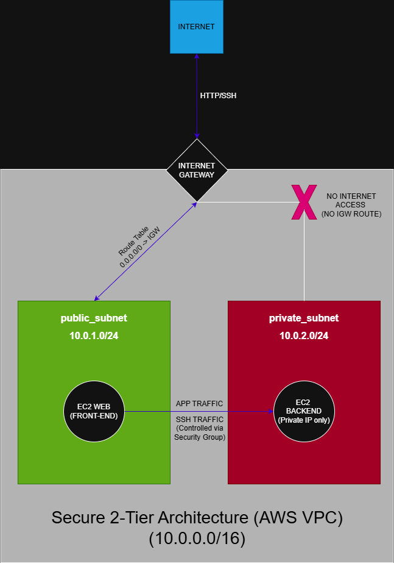

# AWS Secure 2-Tier Architecture

This project demonstrates a basic secure 2-tier architecture built on AWS, focusing on network segmentation and controlled communication between resources.

## Architecture Diagram



## Components

- Custom VPC (`10.0.0.0/16`)
- Public Subnet (`10.0.1.0/24`)
- Private Subnet (`10.0.2.0/24`)
- Internet Gateway
- Route Table with `0.0.0.0/0 -> IGW` for the public subnet
- Public EC2 instance running Apache (HTTP server)
- Private EC2 instance with private IP only
- Security Groups controlling communication between layers

## Architecture Decisions

- The public EC2 instance is internet-facing and acts as the entry point
- The private EC2 instance does not have a public IP
- The private instance is not reachable directly from the internet
- SSH access to the private EC2 is restricted using the Security Group of the public EC2
- Communication is controlled through segmentation and trusted internal access

## Traffic Flow

1. A request comes from the Internet
2. The Internet Gateway provides internet access to the public subnet
3. The Route Table directs external traffic (`0.0.0.0/0`) to the Internet Gateway
4. The public EC2 receives the request
5. The public EC2 can communicate with the private EC2 through controlled internal rules
6. The private EC2 remains isolated from direct internet access

## Practical Validation

To validate the architecture, I established an SSH connection from the public EC2 to the private EC2 using its private IP:

```bash
ssh -i chave-projeto.pem ec2-user@10.0.2.xxx
```
## This confirmed that:

- The backend is not reachable from the internet
- Internal communication inside the VPC works as expected
- Access between layers is explicitly controlled
  
## Lessons learned:

- Network segmentation is a core part of cloud security
- Security Groups can be used to enforce trusted communication between resources
- Private resources should not be directly exposed to the internet
- Designing the architecture before implementation improves clarity and reduces mistakes
- Understanding traffic flow helps build more secure cloud environments
